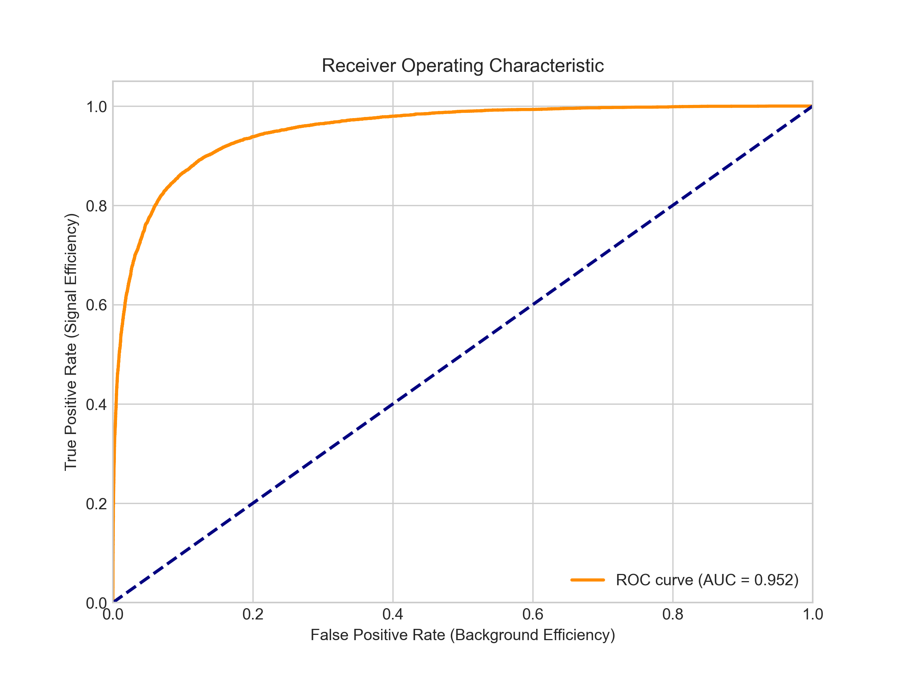

# Di-Tau Signal Classification using Deep Neural Networks


## Project Overview
This project implements a **Deep Neural Network (DNN)** to classify high-energy physics events from the ATLAS detector. The goal is to distinguish rare **Higgs boson decays** ($H \to \tau\tau$, Signal) from common background noise ($Z \to \tau\tau$, Background).

This is a classic **imbalanced binary classification problem** involving high-dimensional kinematic data.

**Key Achievements:**
* Achieved **AUC-ROC Score of 0.93**.
* Implemented a robust **ETL pipeline** handling H5 file structures and dynamic feature extraction.
* Applied domain-specific **Kinematic Filtering** to reduce noise by ~60% before training.
* Designed a modular, object-oriented codebase suitable for production scaling.

## Results
The model was evaluated on a hold-out test set of ~40,000 events.

| Metric | Score |
| :--- | :--- |
| **AUC** | **0.93** |
| **Accuracy** | 0.86 |
| **Precision** | 0.69 |
| **Recall** | 0.86 |

*(Note: High recall was prioritized to ensure no potential signal events were missed.)*




*Figure 1: Receiver Operating Characteristic (ROC) curve demonstrating strong separation power.*

## Methodology

### 1. Data Engineering (`src/data_loader.py`)
* **Robust Loading:** Custom `H5DataLoader` class handles inconsistent column naming and shape mismatches (1D vs 2D arrays) across large H5 datasets.
* **Merging:** Dynamically merges event-level metadata with particle-level kinematic data (Jets, Leptons, MET).

### 2. Physics Preprocessing (`src/preprocessor.py`)
* **Event Topology Filtration:** Implements strict physics cuts (e.g., $p_T > 27$ GeV, $|\eta| < 2.5$) to ensure data quality.
* **Feature Engineering:** Extracts high-level features (Particle Multiplicity) and selects the top 2 most energetic jets per event.
* **Unit Standardization:** Auto-corrects energy units (MeV to GeV) for numerical stability.

### 3. Model Architecture (`src/model.py`)
* **Architecture:** Fully Connected Deep Neural Network (DNN).
* **Specs:** 6 Hidden Layers, PReLU activation, and Dropout (0.2) for regularization.
* **Training:** Optimized using Adam optimizer and Binary Crossentropy loss with **Class Weights** to handle signal imbalance.

##  Repository Structure
```text
├── data/                   # Raw H5 datasets (Signal/Background)
├── src/
│   ├── data_loader.py      # H5 parsing and dataframe merging
│   ├── preprocessor.py     # Kinematic cuts and feature selection
│   ├── model.py            # Keras model architecture
│   └── utils.py            # Visualization and metrics
├── main.ipynb              # Executive notebook (Run this to reproduce results)
├── requirements.txt        # Dependencies
├── README.md               # Project 
└── Physics background.pdf  # Explaining the physics behind the project 